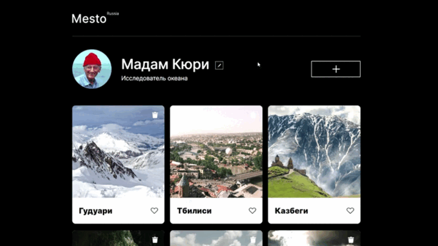
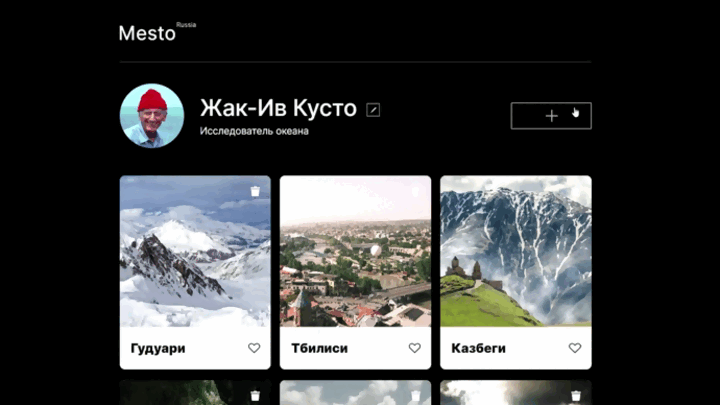
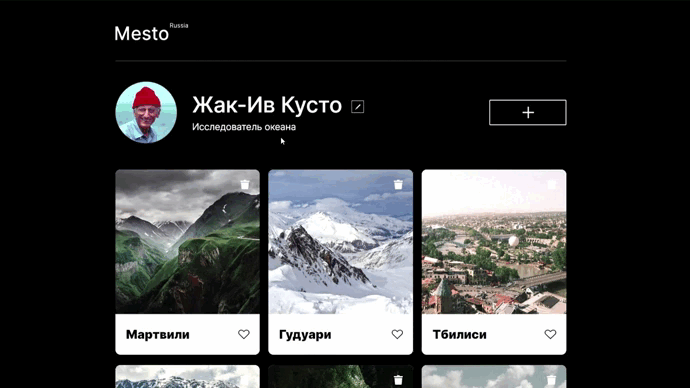
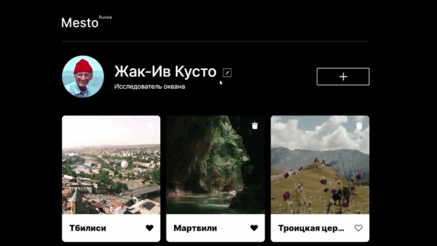

<a id="readme-top"></a>


<details>
<summary>Содержание</summary>
  <ol>
    <li>
      <a href="#о-проекте">О проекте</a>
      <ul>
        <li><a href="#стек-технологий">Стек техологий</a></li>
        <li><a href="#функциональность">Функциональность</a></li>
        <li><a href="#демо-проекта">Демо проекта</a></li>
      </ul>
    </li>
    <li>
      <a href="#инструкция-по-развертыванию">Инструкция по развертыванию</a>
      <ul>
        <li><a href="#системные-требования">Системные требования</a></li>
        <li><a href="#установка">Установка</a></li>
      </ul>
    </li>
    <li><a href="#автор">Usage</a></li>
    <li><a href="#roadmap">Roadmap</a></li>
    <li><a href="#contributing">Contributing</a></li>
    <li><a href="#license">License</a></li>
    <li><a href="#contact">Contact</a></li>
    <li><a href="#acknowledgments">Acknowledgments</a></li>
  </ol>
</details>

## О проекте

Приложение разработано для пользователей, которые хотят поделится
фотографиями своих любимых мест

> Проект был реализован в рамках изучения фреймворка клиентской части React и серверной Express. <br>В процессе разработки изучил:
>
> - **React**
>   - основную функциональность,
>   - API запросы,
>   - работу с хуками,
>   - создание пользовательских хуков,
>   - подписку на контекст
>   - создание управляемых компонентов
>   - применение localStorage
> - **Express**
>   - основную функциональность,
>   - работу с куками,
>   - создание JWT,
>   - CORS,
>   - подключение к базе данных MongoDB,
>   - валидация данных с помошью Joi
>   - логирование запросов и ошибок
> - **Nginx**
>   - основную функциональность
>   - определение виртуального сервера по имени
>   - SSL сертификаты

### Стек технологий

[![Nginx][Nginx]][Nginx-url] [![React][React.js]][React-url] [![CSS3][CSS3]][CSS3-url] [![Node.js][Node.js]][Node-url] [![Express][Express.js]][Express-url] [![HTML5][HTML5]][HTML5-url] [![MongoDb][MongoDB]][MongoDB-url]

<p align="right"><a href="#readme-top"></a></p>

### Функциональность

- Адаптивная верстка сайта для устройств, с разрешением экрана от 320px (максимальная ширина контента 880px);
- Регистрация и авторизация пользователя,
- Аторизация пользователя по JWT,
- В проекте реализованы возможности:

  - Редактирование профиля;
    

  - Добавление новой карточки с фотографией;
    

  - Удаление и лайк карточки;
    

  - открытие карточки в полноэкранном виде;
    

<p align="right"><a href="#readme-top"></a></p>

### Демо проекта

<p align="center"><a href="https://zhdko.github.io/mesto-react/"></a></p>

## Инструкция по развертыванию

### Системные требования

| software | version |
| -------- | ------: |
| node     |  19.0.0 |
| npm      |   9.3.1 |
| mongod   |  4.4.20 |

<details>
<summary>Front-end</summary>

| packet           | version |
| ---------------- | ------: |
| react, react-dom |  18.2.0 |
| react-router-dom |   6.9.0 |

</details>
<details>
<summary>Back-end</summary>

| packet                    | version |
| ------------------------- | ------: |
| bcryptjs                  |   2.4.3 |
| celebrate                 |  15.0.1 |
| cookie-parser             |   1.4.6 |
| cors                      |   2.8.5 |
| eslint                    |  8.38.0 |
| eslint-config-airbnb-base |  15.0.0 |
| eslint-plugin-import      |  2.27.5 |
| express                   |  4.18.2 |
| express-winston           |   4.2.0 |
| express-rate-limit        |   6.7.0 |
| helmet                    |   7.0.0 |
| jsonwebtoken              |   9.0.0 |
| mongoose                  |   7.0.4 |
| nodemon                   |  2.0.22 |
| validator                 |  13.9.0 |
| winston                   |   3.8.2 |

</details>
<p align="right"><a href="#readme-top"></a></p>

### Установка

1. Установить все необходимые [программы](#системные-требования)
2. Клонировать репозиторий и установить зависимости:

```bash
# Clone the project:
git clone https://github.com/Zhdko/react-mesto-api-full-gha.git
cd react-mesto-api-full-gha

# Install the dependencies:
cd frontend
npm install
cd ..

cd backend
npm install
```

3. Настройка конфигурационного файла

   > Адрес сервера Mongo по умолчанию: `mongodb://localhost:27017`,<br> в этом проекте используется другой путь. <br> Отредактируйте путь на ваш

   - Перейти в файл `/backend/utils/config.js`
   - Ввести свой путь к базе данных вместо `'mongodb://127.0.0.1:27017/mesto'`

   ```javascript
   const MONGO_DB = NODE_ENV === 'production' ? DB : 'mongodb://127.0.0.1:27017/mesto';
   ```

4. Запусть MongoDB в терминале

```bash
  mongod
```

5. Запустить сервер из деректории `/react-mesto-api-full-gha/backend`

```bash
  npm start
```

6. Запустите реакт приложение из деректории `/react-mesto-api-full-gha/backend`

```bash
  npm run start
```

[](https://git.io/typing-svg)

<p align="right"><a href="#readme-top"></a></p>

## <a id='автор'></a>

<div align='right'>
  <a href='https://github.com/Zhdko'></a>
  <a href='https://www.linkedin.com/in/zhdko/'></a>
</div>

<!-- MARKDOWN LINKS & IMAGES -->

[Nginx]: ./frontend/src/images/readme/techologes/nginx.svg
[Nginx-url]: https://nginx.org/
[React.js]: ./frontend/src/images/readme/techologes/react.svg
[React-url]: https://reactjs.org/
[CSS3]: ./frontend/src/images/readme/techologes/css3.svg
[CSS3-url]: https://www.w3.org/Style/CSS/
[Node.js]: ./frontend/src/images/readme/techologes/node.svg
[Node-url]: https://nodejs.org/en
[Express.js]: ./frontend/src/images/readme/techologes/express.svg
[express-url]: https://expressjs.com
[HTML5]: ./frontend/src/images/readme/techologes/html5.svg
[HTML5-url]: https://html.com/html5/
[MongoDB]: ./frontend/src/images/readme/techologes/MongoDB.svg
[MongoDB-url]: https://www.mongodb.com/
